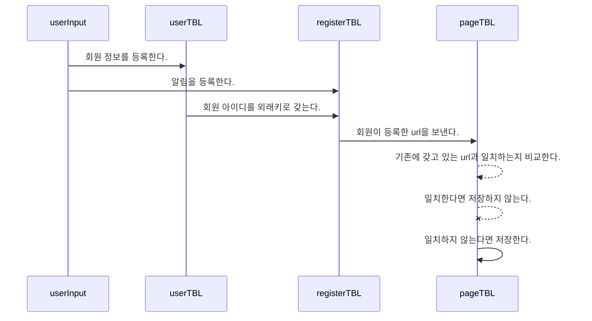

# Mechurial_project

## Description
메추리알이란, 사용자가 원하는 사이트의 **URL**과 **Keyword**, 그리고 **알림조건**을 입력하게 되면 주기적으로 크롤링을 통해 원하는 조건에 맞는 글이 업로드 되면 회원가입시 설정한 **메일로 알림이 가는 서비스** 입니다.

## High Level Diagram

****
> 서비스 전체 HLD 


## Environment
**Google Cloud Platform의 VM Instance를 사용중입니다.**

OS:  Ubuntu [20.04LTS]

Node.js:  v16.15.1

npm: v8.11.0


## Installation

- Ubuntu에서 puppeteer를 실행시키기 위한 패키지들

```
sudo apt-get install -y gconf-service libasound2 libatk1.0-0 libc6 libcairo2 libcups2 libdbus-1-3 libexpat1 libfontconfig1 libgcc1 libgconf-2-4 libgdk-pixbuf2.0-0 libglib2.0-0 libgtk-3-0 libnspr4 libpango-1.0-0 libpangocairo-1.0-0 libstdc++6 libx11-6 libx11-xcb1 libxcb1 libxcomposite1 libxcursor1 libxdamage1 libxext6 libxfixes3 libxi6 libxrandr2 libxrender1 libxss1 libxtst6 ca-certificates fonts-liberation libappindicator1 libnss3 lsb-release xdg-utils wget
```
```
sudo apt-get install libgtk2.0-0 libgtk-3-0 libnotify-dev libgconf-2-4 libnss3 libxss1 libasound2 libxtst6 xauth xvfb libgbm-dev
```

- 서버를 실행시키기 위한 Node 모듈들

```
npm init
```
```
npm i -S express express-ejs-layouts sequelize mysql2 http-status-codes dotenv ejs @sendgrid/mail puppeteer cheerio node-cron bcrypt
```

## How to Run
- `.env` 파일에 DB_USER, DB_PW, DB_NAME, DB_HOST 를 먼저 채워주세요.
- mysql에서 아래 명령어를 통해 사용할 db를 생성해주세요.
```
create DB_NAME명
```
이후 권한 오류가 발생한다면, mysql에 아래 명령어를 입력해주세요.
```
grant all on DB_NAME명.*to 'DB_USER명'@'%';
```
서버를 실행시키기 위해 아래 명령어를 입력해주세요.
```
sudo node main
```

## Crawling

**
> 크롤링 과정 소개
> 
	
	크롤링 전체 과정 :  url 크롤링 html 파일로 저장 + 키워드와 조건만족 여부 확인 + 만족시 사용자에게 메일 전송 & DB에서 인스턴스 삭제

## 등록추가 UML



